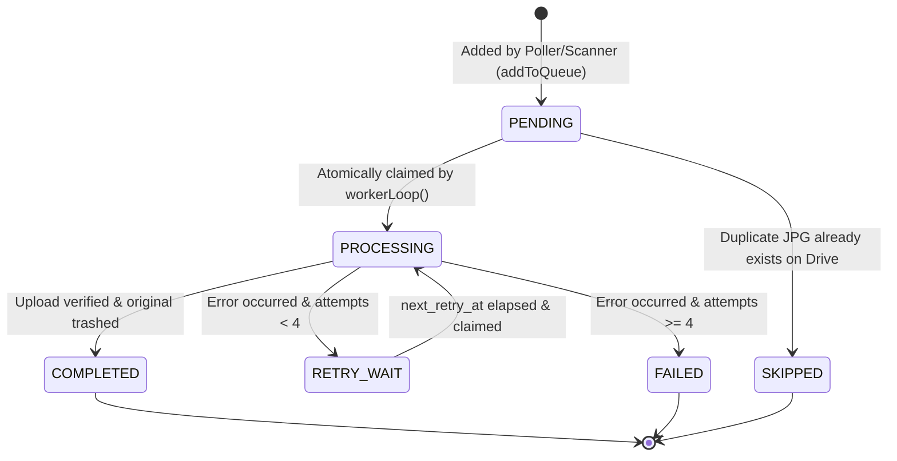
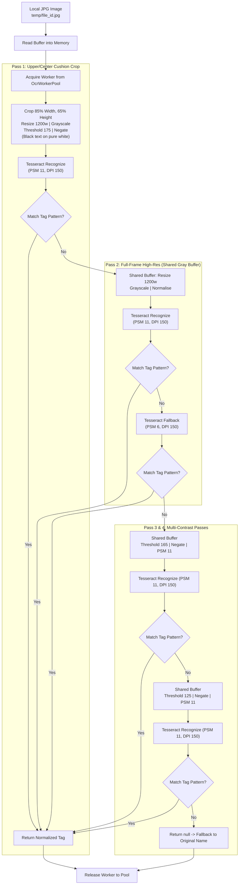

# System Design Document
## HEIC Drive Converter — Complete Technical Architecture & Implementation Blueprint

---

## 1. High-Level Technical Architecture

The **HEIC Drive Converter** is structured as an asynchronous, decoupled, worker-driven pipeline. It separates **Google Drive folder discovery** from **local queue processing**, ensuring that network polling intervals never throttle or interrupt active conversions.

```mermaid
graph TD
    subgraph "Google Drive Cloud"
        GD_Folder["Target Google Drive Folder<br/>(GOOGLE_DRIVE_FOLDER_ID)"]
    end

    subgraph "VPS Process Boundary (Node.js Daemon)"
        DrivePoller["Drive Poller (src/index.js)<br/>• setInterval(checkFolder, pollIntervalMs)<br/>• drive.listFolderFiles()"]
        Cache["In-Memory Filename Cache<br/>(folderFilenameCache Set)"]
        
        subgraph "Persistence Layer (SQLite WAL)"
            QueueDB[("conversion_queue<br/>(data/queue.sqlite)")]
        end

        subgraph "Worker Pool & Processing Engine (src/queue.js)"
            Worker1["Worker Loop #1<br/>(claimNextPendingJob)"]
            Worker2["Worker Loop #2<br/>(claimNextPendingJob)"]
            WorkerN["Worker Loop #N<br/>(maxConcurrentConversions)"]
        end

        subgraph "Conversion & Validation Engine"
            PythonEngine["Python pillow-heif (src/convert_heic.py)<br/>• HDR -> 8-bit<br/>• Display P3 -> sRGB (ImageCms)<br/>• 4:4:4 Subsampling"]
            FallbackEngines["Fallback Engines (src/converter.js)<br/>• FFmpeg (yuvj444p)<br/>• Sharp / libheif-js WASM"]
            Validator["Validator (src/validator.js)<br/>• Magic Bytes (0xFF 0xD8 0xFF)<br/>• Size > 1KB & Dimensions"]
        end

        subgraph "Targeted Local OCR Engine (src/ocr.js)"
            OcrPool["Tesseract.js Worker Pool (Offline)<br/>• eng.traineddata<br/>• Alphanumeric Whitelist"]
            SharpPrep["Multi-Pass Preprocessor (Sharp)<br/>• Pass 1: Velvet Cushion Crop (Thresh 175 Negate)<br/>• Pass 2: Full-Frame High-Res (PSM 11/6)<br/>• Pass 3/4: High/Med Contrast (Thresh 165/125)"]
            TaxonomyMatcher["Jewelry Taxonomy Regex & Fixes<br/>• 0/O/Q -> D Normalization<br/>• Ghost S & Trailing Digit Repair<br/>• Prefix Priority Hierarchy"]
        end

        subgraph "Drive Upload & Safe Deletion"
            Uploader["Drive Uploader (src/drive.js)<br/>• Unique Suffix Generator<br/>• Stream Upload"]
            Verifier["Post-Upload Verifier (src/drive.js)<br/>• checkFileExists(uploadedId)"]
            Trasher["Safe Trasher (src/drive.js)<br/>• drive.trashFile(file_id) (if TEST_MODE=false)"]
        end
    end

    %% Flow connections
    GD_Folder -->|List Files (1000/page)| DrivePoller
    DrivePoller -->|Populate / Read| Cache
    DrivePoller -->|Insert Candidates| QueueDB
    
    QueueDB -->|Atomic Optimistic Claim| Worker1
    QueueDB -->|Atomic Optimistic Claim| Worker2
    QueueDB -->|Atomic Optimistic Claim| WorkerN

    Worker1 & Worker2 & WorkerN -->|1. Download Media Stream| GD_Folder
    Worker1 & Worker2 & WorkerN -->|2. Convert HEIC -> JPG| PythonEngine
    PythonEngine -.->|Fallback if needed| FallbackEngines
    PythonEngine -->|3. Verify Quality| Validator
    Validator -->|4. Detect Tag No.| SharpPrep
    SharpPrep --> OcrPool
    OcrPool --> TaxonomyMatcher
    TaxonomyMatcher -->|5. Generate Unique Name| Cache
    Cache -->|6. Upload JPG Stream| Uploader
    Uploader -->|Save Converted JPG| GD_Folder
    Uploader -->|7. Verify File ID| Verifier
    Verifier -->|8. Trash Source HEIC| Trasher
    Trasher -->|Move to Trash| GD_Folder
    Verifier -->|9. Mark COMPLETED| QueueDB
```

---

## 2. File-by-File Architecture

| File Path | Primary Responsibility | Important Functions / Exports | Depends On | Used By |
|---|---|---|---|---|
| [`src/config.js`](file:///d:/automation/heic-drive-converter/src/config.js) | Centralized configuration loader and environment validator | `config` object (folder ID, paths, intervals, quality, concurrency) | `dotenv`, `path` | All modules |
| [`src/logger.js`](file:///d:/automation/heic-drive-converter/src/logger.js) | Structured console and log formatting with timestamps | `logger.info`, `logger.warn`, `logger.error` | Built-in JS | All modules |
| [`src/db.js`](file:///d:/automation/heic-drive-converter/src/db.js) | SQLite database connection, WAL pragmas, and Promise wrappers | `init()`, `run(sql, params)`, `get(sql, params)`, `all(sql, params)`, `db` | `sqlite3`, `config`, `logger` | `src/queue.js`, `src/index.js`, `src/scanner.js`, `src/status.js` |
| [`src/drive.js`](file:///d:/automation/heic-drive-converter/src/drive.js) | Google Drive API client (OAuth2/Service Account), file ops, caching | `listFolderFiles()`, `downloadFile()`, `uploadFile()`, `trashFile()`, `checkFileExists()`, `checkFilenameExistsInFolder()`, `getUniqueFilenameInFolder()` | `googleapis`, `config`, `logger` | `src/index.js`, `src/scanner.js`, `src/queue.js` |
| [`src/convert_heic.py`](file:///d:/automation/heic-drive-converter/src/convert_heic.py) | Standalone Python script for HDR HEIC decoding, sRGB conversion, and JPEG save | `convert_heic_to_jpg(input_path, output_path, quality)` | `pillow_heif`, `PIL (Image, ImageCms, ImageOps)` | `src/converter.js` |
| [`src/converter.js`](file:///d:/automation/heic-drive-converter/src/converter.js) | Multi-engine conversion runner with fallback chain and engine caching | `convertHeicToJpg()`, `convertWithPythonPillow()`, `convertWithFfmpeg()`, `convertWithSharp()`, `convertWithLibheifJsSharp()`, `convertWithHeicConvertNpm()`, `convertWithHeifConvert()`, `convertWithImageMagick()` | `child_process`, `sharp`, `ffmpeg-static`, `libheif-js`, `heic-convert`, `config`, `logger` | `src/queue.js` |
| [`src/validator.js`](file:///d:/automation/heic-drive-converter/src/validator.js) | Pre-upload JPEG integrity and quality verification | `validateJpg(filePath)` | `image-size`, `sharp`, `fs`, `logger` | `src/queue.js` |
| [`src/ocr.js`](file:///d:/automation/heic-drive-converter/src/ocr.js) | Multi-pass Sharp image preprocessor, Tesseract worker pool, and jewelry tag extraction | `detectTagFromImage()`, `extractTagPattern()`, `normalizeOcrText()`, `prewarmWorker()`, `terminateWorker()`, `OcrWorkerPool`, `JEWELRY_CATALOG_PREFIXES` | `tesseract.js`, `sharp`, `fs`, `path`, `logger` | `src/queue.js`, `src/index.js`, `test_ocr.js` |
| [`src/queue.js`](file:///d:/automation/heic-drive-converter/src/queue.js) | Job queue lifecycle, atomic worker loops, retry backoff, and cleanup | `addToQueue()`, `claimNextPendingJob()`, `updateJobStatus()`, `handleJobFailure()`, `processJob()`, `workerLoop()`, `processQueue()`, `shutdown()`, `cleanupOrphanedTempFiles()`, `getActiveCount()` | `src/db.js`, `src/drive.js`, `src/converter.js`, `src/validator.js`, `src/ocr.js`, `src/config.js`, `src/logger.js` | `src/index.js`, `src/scanner.js` |
| [`src/index.js`](file:///d:/automation/heic-drive-converter/src/index.js) | Production 24/7 daemon entry point, periodic Drive polling, graceful shutdown | `startDaemon()`, `checkFolder()`, `gracefulShutdown()` | `src/db.js`, `src/config.js`, `src/logger.js`, `src/drive.js`, `src/queue.js`, `src/ocr.js` | PM2 / `npm start` |
| [`src/scanner.js`](file:///d:/automation/heic-drive-converter/src/scanner.js) | Standalone CLI bulk backlog scanner and runner | `runScan()` | `src/db.js`, `src/drive.js`, `src/queue.js`, `src/config.js`, `src/logger.js` | `npm run scan` |
| [`src/verifier.js`](file:///d:/automation/heic-drive-converter/src/verifier.js) | Independent folder-level converted image verification service (Architecture C+D) | `runVerification()`, `verifySingleFile()`, `isConversionQueueIdle()`, `extractExpectedTagFromFilename()`, `isVerifiableJpg()`, `verifyOcrPool` | `src/db.js`, `src/drive.js`, `src/ocr.js`, `src/validator.js`, `src/queue.js`, `src/config.js`, `src/logger.js` | `npm run verify:folder` |
| [`src/status.js`](file:///d:/automation/heic-drive-converter/src/status.js) | Operational CLI metrics report and terminal dashboard | `showStatus()` | `src/db.js`, `src/logger.js` | `npm run status` |
| [`test_ocr.js`](file:///d:/automation/heic-drive-converter/test_ocr.js) | OCR benchmark test suite and single-image testing CLI | `runBenchmarkSuite()`, `testSingleImage()` | `src/ocr.js`, `sharp` | `npm run test:speed` |
| [`ecosystem.config.js`](file:///d:/automation/heic-drive-converter/ecosystem.config.js) | PM2 process manager configuration | PM2 app descriptor (`fork` mode, `800M` limit, log routes) | PM2 runtime | PM2 CLI |

---

## 3. Detailed Component Specifications

### 3.1 SQLite Database & Persistence (`src/db.js`)
- **Database Engine**: `sqlite3` (v5.1.7).
- **Physical File**: Stored at `DB_PATH` (`data/queue.sqlite`).
- **PRAGMA Optimizations**:
  - `PRAGMA journal_mode = WAL;` (Write-Ahead Logging allows concurrent reads while writing).
  - `PRAGMA busy_timeout = 10000;` (Waits up to 10 seconds for locks before throwing `SQLITE_BUSY`).
  - `PRAGMA synchronous = NORMAL;` (Ensures durability while reducing disk sync overhead).
- **Table Schema**:
```sql
CREATE TABLE IF NOT EXISTS conversion_queue (
  file_id TEXT PRIMARY KEY,
  filename TEXT NOT NULL,
  ext TEXT NOT NULL,
  mime_type TEXT,
  target_filename TEXT NOT NULL,
  status TEXT NOT NULL,
  attempts INTEGER DEFAULT 0,
  last_error TEXT,
  created_at INTEGER NOT NULL,
  updated_at INTEGER NOT NULL,
  started_at INTEGER,
  completed_at INTEGER,
  next_retry_at INTEGER DEFAULT 0
);
```

#### Job State Lifecycle


- **Startup Crash Auto-Recovery**:
  When the daemon or scanner boots, `db.init()` executes:
  ```sql
  UPDATE conversion_queue SET status = 'PENDING' WHERE status = 'PROCESSING';
  ```
  This immediately recovers jobs that were left in mid-flight when a server power outage, PM2 reload, or system reboot occurred.

---

### 3.2 Queue Architecture & Worker Pool (`src/queue.js`)

#### Job Claiming Mechanics
To guarantee zero duplicate processing across concurrent workers, `claimNextPendingJob()` utilizes an **optimistic locking pattern**:
```javascript
// 1. Find oldest eligible pending or retry job
const job = await db.get(`
  SELECT * FROM conversion_queue 
  WHERE status = 'PENDING' OR (status = 'RETRY_WAIT' AND next_retry_at <= ?)
  ORDER BY created_at ASC 
  LIMIT 1
`, [Date.now()]);

// 2. Atomically flip status to PROCESSING
const result = await db.run(`
  UPDATE conversion_queue 
  SET status = 'PROCESSING', started_at = ?, updated_at = ?
  WHERE file_id = ? AND status = ?
`, [now, now, job.file_id, job.status]);

// 3. Verify atomic ownership
if (result.changes === 0) {
  return null; // Another worker claimed it; collision avoided
}
```

#### Worker Pool Lifecycle & Concurrency
- `activeConversions`: In-memory counter tracking active worker threads.
- `config.maxConcurrentConversions`: Cap on concurrent workers (default: 2, configured: 4).
- `processQueue()`: Launches self-sustaining worker loops up to the configured limit:
  ```javascript
  while (activeConversions < config.maxConcurrentConversions && !isGracefulShutdown) {
    activeConversions++;
    (async () => {
      try {
        await workerLoop();
      } finally {
        activeConversions--;
      }
    })();
  }
  ```

#### Historical Queue Bug vs Current Implementation

> [!WARNING]
> ### HISTORICAL ISSUE (Worker Loop Race Condition)
> In earlier versions, when multiple concurrent workers queried the database at the same instant, one worker successfully updated the job while the other worker received `result.changes === 0` (claim collision). The colliding worker treated `claimNextPendingJob() === null` as a signal that the entire queue was empty and immediately terminated its loop (`break`).
> As a result:
> 1. Workers terminated prematurely even when dozens of pending files remained in SQLite.
> 2. Processing stalled until the next Google Drive poll interval (60s) fired and triggered `processQueue()`.
> 3. Throughput was artificially throttled to the polling frequency.

> [!IMPORTANT]
> ### CURRENT IMPLEMENTATION (Verified Resilient Worker Loop)
> In the current codebase (`src/queue.js:257-285`), when `claimNextPendingJob()` returns `null`, the worker performs a fast database count check before deciding to terminate:
> ```javascript
> if (!job) {
>   const now = Date.now();
>   const countRow = await db.get(
>     "SELECT COUNT(*) as count FROM conversion_queue WHERE status = 'PENDING' OR (status = 'RETRY_WAIT' AND next_retry_at <= ?)",
>     [now]
>   );
>   if (countRow && countRow.count > 0 && !isGracefulShutdown) {
>     // Jobs still exist in queue; yield 50ms to resolve lock contention before claiming next
>     await new Promise(r => setTimeout(r, 50));
>     continue;
>   }
>   // No remaining pending jobs; exit loop cleanly
>   break;
> }
> ```
> This guarantees that worker loops continue processing pending backlog autonomously without waiting for Google Drive polling.

---

### 3.3 Google Drive Integration & Polling (`src/drive.js`, `src/index.js`)

#### Decoupled Architecture
Google Drive polling and local queue workers are completely decoupled:
1. `checkFolder()` runs on a timer (`setInterval`, default: 60s) solely to discover new files and insert them into SQLite as `PENDING`.
2. `workerLoop()` runs independently on the VPS, pulling directly from SQLite until all pending jobs are completed.

#### Google Drive API Configuration
- Client: `googleapis` (v122.0.0).
- Authentication:
  - **Service Account**: Authenticates via `GOOGLE_APPLICATION_CREDENTIALS` (`credentials.json`) with scope `https://www.googleapis.com/auth/drive`.
  - **OAuth2**: Supports `GOOGLE_CLIENT_ID`, `GOOGLE_CLIENT_SECRET`, and `GOOGLE_REFRESH_TOKEN` if provided.
- Pagination: Loops through `drive.files.list()` with `pageSize: 1000` until `nextPageToken` is null.
- Shared Drives: Explicitly enables `supportsAllDrives: true`, `includeItemsFromAllDrives: true`, and `corpora: 'allDrives'`.

#### In-Memory Filename Cache (`folderFilenameCache`)
To avoid repetitive Drive API list calls during name generation:
- `drive.listFolderFiles()` populates a global `Set` of lowercase filenames.
- `checkFilenameExistsInFolder()` checks the Set in 0 ms.
- Newly uploaded filenames are immediately registered in the Set via `folderFilenameCache.add()`.

---

### 3.4 Local OCR Architecture & Image Preprocessing (`src/ocr.js`)

The OCR subsystem reads jewelry tag codes from images entirely offline.



#### Historical OCR Issue vs Current Implementation

> [!WARNING]
> ### HISTORICAL OCR ISSUE (Velvet Background Texture Noise)
> Jewelry photos are commonly shot on dark green or black velvet display cushions. Velvet fabric weave creates fine surface texture, micro-shadows, and gold reflections.
> In earlier versions:
> 1. Full-frame OCR with a low binarization threshold (135) turned velvet weave into heavy speckled salt-and-pepper noise.
> 2. Tesseract misread or failed to detect white printed tag text (e.g., `DBR330`, `DBR334`).
> 3. Converted images fell back to original filenames (e.g., `IMG_9422.jpg`).

> [!IMPORTANT]
> ### CURRENT IMPLEMENTATION (Targeted Cushion Crop & High-Contrast Threshold 175)
> In the current codebase (`src/ocr.js:268-296`):
> 1. **Pass 1 Cushion Crop**: Crops the upper-center region (`left: (w-cw)/2`, `top: h*0.05`, `width: w*0.85`, `height: h*0.65`) where cushion tags reside.
> 2. **Threshold 175 + Inversion**: `sharp(buf).grayscale().threshold(175).negate()` completely eliminates 100% of dark green velvet weave and reflection noise, isolating pure black text on a clean white background.
> 3. **Page Segmentation Mode (PSM 11)**: `tessedit_pageseg_mode = 11` (Sparse Text) detects text fragments without requiring tabular layout.
> 4. **Pre-warmed Offline Worker**: Loads `eng.traineddata` locally at daemon startup, avoiding runtime download delays.

#### Normalization & Regex Parser
`extractTagPattern()` enforces a strict taxonomy hierarchy:
1. **Catalog Prefixes**: Matched in descending length order (`sort((a,b) => b.length - a.length)`):
   - `BN GOLD`, `CP GOLD`, `CS GOLD`, `LS GOLD`, `NS GOLD`, `PS GOLD`
   - `ACCH`, `AADI`, `KADA`, `PAYAL`, `DKDA`, `GKDA`, `DJUM`, `GJUM`, `BALI`
   - `DBN`, `DBR`, `DER`, `DGR`, `DLR`, `DMS`, `DNP`, `DNS`, `DPS`, `DCH`, `DNC`, `DTK`, `DPD`
   - `GBN`, `GBR`, `GER`, `GGR`, `GLR`, `GMS`, `GNP`, `GNS`, `GPS`, `GCH`, `GNC`, `GTK`, `GPD`
   - `CVD`, `RNG`, `JUM`, `PAY`, `KDA`
   - 2-letter codes: `BN`, `BR`, `ER`, `GR`, `LR`, `MS`, `NP`, `NS`, `PS`, `CP`, `CS`, `LS`, `TK`, `BA`, `CH`, `NC`, `DP`, `GP`, `PD` (requires $\ge 3$ digits).
2. **Ghost Character Elimination**: `DERS556` $\to$ `DER556`.
3. **Trailing Digit Repairs**: `DBR32B` $\to$ `DBR328`, `DBR32S` $\to$ `DBR325`, `DBR32O` $\to$ `DBR320`, `DBR32I` $\to$ `DBR321`.
4. **Noise Blacklist**: Rejects words like `PHOTO`, `IMAGE`, `HEIC`, `JPEG`, `CAMERA`, `APPLE`, `IPHONE`, `GOLD`, `RING`.

---

### 3.5 HEIC Conversion & Color Pipeline (`src/convert_heic.py`, `src/converter.js`)

#### Python Conversion Process (`src/convert_heic.py`)
The primary engine executes via Python 3:
```python
# 1. Open with explicit HDR to 8-bit mapping (prevents green/red tile artifacts)
heif_file = pillow_heif.open_heif(input_path, convert_hdr_to_8bit=True)
image = heif_file.to_pillow()

# 2. Handle EXIF orientation
image = ImageOps.exif_transpose(image) or image

# 3. Universal sRGB Color Pipeline
srgb_profile = ImageCms.createProfile("sRGB")
srgb_profile_bytes = ImageCms.ImageCmsProfile(srgb_profile).tobytes()

icc_profile = image.info.get("icc_profile")
if icc_profile:
    try:
        input_profile = ImageCms.getOpenProfile(io.BytesIO(icc_profile))
        transformed = ImageCms.profileToProfile(image, input_profile, srgb_profile, outputMode="RGB")
        if transformed is not None:
            image = transformed
    except Exception:
        pass

# 4. Update metadata to sRGB profile
image.info["icc_profile"] = srgb_profile_bytes

# 5. Normalize color channels & transparency flattening
if image.mode in ("RGBA", "LA") or (image.mode == "P" and "transparency" in image.info):
    background = Image.new("RGB", image.size, (255, 255, 255))
    background.paste(image, mask=image.split()[-1])
    image = background
elif image.mode != "RGB":
    image = image.convert("RGB")

# 6. Save JPEG with 4:4:4 subsampling and embedded sRGB profile
image.save(output_path, "JPEG", quality=int(quality), subsampling=0, icc_profile=srgb_profile_bytes, exif=image.info.get("exif"))
```

#### Color Pipeline Summary
1. **Source Gamut**: Apple Display P3 / Wide Gamut HDR HEIC.
2. **Pixel Transformation**: Transformed from source ICC profile into standard sRGB space via LittleCMS (`ImageCms.profileToProfile`).
3. **ICC Profile Metadata**: Output JPEG embeds verified sRGB profile bytes. The system **never** attaches source P3 metadata to converted sRGB pixel buffers.
4. **Chroma Subsampling**: Set to `subsampling=0` (4:4:4 YUV). This ensures razor-sharp text edges on jewelry tags and zero color bleeding on fine gold facets.
5. **Transparency**: Alpha channels are flattened against a pure white `(255, 255, 255)` background.

#### Multi-Engine Fallback Chain
If Python `pillow-heif` is unavailable in the environment, `src/converter.js` automatically cascades through:
1. `python-pillow` (Default, gold standard for Apple 10-bit HDR).
2. `ffmpeg-native` (Compiled C binary, `-pix_fmt yuvj444p`, ~0.15s).
3. `sharp-direct` (Native C libvips).
4. `libheif-js-sharp` (WASM decoder + MozJPEG 4:4:4 encoder).
5. `heic-convert-npm` (Pure JS fallback).
6. `heif-convert-cli` (System binary).
7. `imagemagick` (`magick` / `convert`).
*Once an engine succeeds, it is cached in `cachedWorkingEngine` to skip retry overhead on subsequent files.*

### 3.10 Folder-Level Converted Image Verification Service (`src/verifier.js`)
The verification service runs independently (Architecture C + D Hybrid) to audit existing converted JPGs on Google Drive:
- **Process Isolation**: Operates as a separate Node.js process via `npm run verify:folder`, completely decoupling memory and event loops from the main conversion daemon.
- **Dedicated OCR Worker**: Instantiates an isolated single-worker OCR pool (`const verifyOcrPool = new ocr.OcrWorkerPool(1)`), eliminating any possibility of acquiring or blocking workers from the production conversion pool.
- **Idle Gating**: Evaluates `isConversionQueueIdle()` via SQLite before processing each file. If `conversion_queue` has any `PENDING` or `PROCESSING` jobs, verification pauses and yields immediately.
- **Tag Extraction from Filename**: `extractExpectedTagFromFilename(filename)` parses catalog codes from filenames (e.g. `DER552.jpg` $\to$ `DER552`, `DER55.jpg` $\to$ `DER55`, `IMG_4008.jpg` $\to$ `null`).
- **Strict Equality Matching**: Compares expected tag against detected image tag with 100% exact equality. Substring matching is strictly prohibited to prevent similar tag collisions (`DBR21` vs `DBR212` vs `DBR213`).
- **State Machine & Audit Storage**: Records all audits in SQLite table `verification_audit` (`UNVERIFIED`, `VERIFYING`, `VERIFIED`, `MISMATCH`, `NO_TAG_DETECTED`, `REVIEW_REQUIRED`, `FAILED`).
- **Controlled Auto-Repair Guard**: `ENABLE_AUTO_REPAIR` defaults to `false`. Mismatches are recorded and reported for operator review; automated renames are disabled initially.

---

## 4. Error Handling & Resilience Matrix

| Failure Point | Detection Mechanism | Immediate Action | DB State Transition | Retry Policy | User / Folder Impact |
|---|---|---|---|---|---|
| **Google Drive List Error** | `drive.files.list` rejection in `checkFolder()` | Log error; skip current poll pass | None (DB unchanged) | Retries on next interval | No files dropped; processing resumes next tick |
| **HEIC Download Failure** | Stream error in `drive.downloadFile()` | Destroy write stream; delete partial file | `RETRY_WAIT` (attempts < 4) or `FAILED` | Exponential backoff (1m, 2m, 5m, 15m) | Original HEIC preserved on Drive |
| **Corrupted HEIC File** | `convertHeicToJpg()` throws across all engines | Aggregates engine errors; logs warning | `RETRY_WAIT` $\to$ `FAILED` | Retried up to 4 attempts | Original file preserved; queue moves to next file |
| **Invalid JPG Output** | `validator.validateJpg()` fails magic bytes/size | Throws validation error; deletes temp files | `RETRY_WAIT` $\to$ `FAILED` | Retried up to 4 attempts | Corrupted JPG never uploaded |
| **OCR Scan Failure / No Tag** | `ocr.detectTagFromImage()` returns `null` | Logs OCR notice; uses fallback name (`IMG_9422.jpg`) | Proceeds to `COMPLETED` | No retry needed (fallback succeeds) | Converted JPG uploaded with original base name |
| **Drive Upload Network Drop** | `drive.uploadFile()` stream error | Destroys read stream; logs error | `RETRY_WAIT` $\to$ `FAILED` | Retried up to 4 attempts | Original HEIC preserved; retry will re-upload |
| **Post-Upload Verify Failure** | `checkFileExists(uploadedId)` returns `false` | Throws verification error; original NOT trashed | `RETRY_WAIT` $\to$ `FAILED` | Retried up to 4 attempts | Prevents data loss; original HEIC kept safe |
| **SQLite Busy / Lock Contention** | `PRAGMA busy_timeout = 10000` | SQLite driver waits up to 10s before error | Handled transparently | Automatic at driver level | Zero lock collision crashes |
| **VPS Sudden Reboot / Crash** | `db.init()` runs on reboot | Resets orphaned `PROCESSING` $\to$ `PENDING` | `PROCESSING` $\to$ `PENDING` | Re-claimed by first active worker | Complete self-healing |

---

## 5. Configuration & Environment Variables

All variables are loaded via [`src/config.js`](file:///d:/automation/heic-drive-converter/src/config.js) using `dotenv`:

| Environment Variable | Description | Default in Code | Required | Example |
|---|---|---|---|---|
| `GOOGLE_DRIVE_FOLDER_ID` | Monitored Google Drive folder ID | *None (Exits if missing)* | **YES** | `1rYRIfxihMXpSki7UI3mlu609nCwGeflh` |
| `GOOGLE_APPLICATION_CREDENTIALS` | Path to Google Service Account JSON | `credentials.json` | Conditional* | `credentials.json` |
| `GOOGLE_CLIENT_ID` | OAuth2 Client ID (if using user auth) | *None* | Optional* | `123456-xxx.apps.googleusercontent.com` |
| `GOOGLE_CLIENT_SECRET` | OAuth2 Client Secret | *None* | Optional* | `GOCSPX-xxxxxxxxxxxx` |
| `GOOGLE_REFRESH_TOKEN` | OAuth2 Refresh Token | *None* | Optional* | `1//04xxxxxxxxxxxxxx` |
| `POLL_INTERVAL_SECONDS` | Folder polling interval in seconds | `5` (5000 ms) | No | `60` |
| `MAX_CONCURRENT_CONVERSIONS` | Maximum parallel conversion workers | `2` | No | `4` |
| `TEST_MODE` | If `true`, prevents trashing original HEIC files | `true` | No | `true` or `false` |
| `JPEG_QUALITY` | Output JPEG quality level (1–100) | `95` | No | `92` or `95` |
| `DB_PATH` | Path to SQLite queue database file | `./data/queue.sqlite` | No | `./data/queue.sqlite` |
| `TEMP_DIR` | Path to local temporary processing folder | `./temp` | No | `./temp` |

*\*Either `GOOGLE_APPLICATION_CREDENTIALS` or the OAuth2 credential trio must be valid to authenticate with Google Drive.*

---

## 6. Dependencies & Runtime Environment

### Node.js Dependencies (`package.json`)
- `googleapis` (`^122.0.0`): Google Drive API v3 communication.
- `sqlite3` (`^5.1.7`): Embedded relational queue persistence.
- `tesseract.js` (`^5.1.1`): Local WebAssembly/JS OCR engine.
- `sharp` (`^0.33.5`): High-speed libvips image transformation and threshold preprocessing.
- `image-size` (`^1.1.1`): Fast image header dimension decoding.
- `ffmpeg-static` (`^5.2.0`): Static FFmpeg binary fallback.
- `libheif-js` (`^1.17.1`): Pure WASM libheif decoder.
- `heic-convert` (`^2.1.0`): Secondary JS HEIC conversion wrapper.
- `heic-decode` (`^2.1.0`): Raw HEIF frame decoder.
- `dotenv` (`^16.4.5`): Environment variable loader.

### Python Dependencies
- `pillow-heif`: Native C-based Apple HEIC/HEIF decoder with 10-bit HDR to 8-bit mapping.
- `Pillow` (PIL): Image manipulation, `ImageCms` ICC color profile transformations, and JPEG encoder.

### System & Deployment Architecture
- **Runtime**: Node.js (v18+ LTS) on Ubuntu Linux VPS.
- **Process Manager**: PM2 configured via `ecosystem.config.js`:
  - `exec_mode: 'fork'`
  - `instances: 1`
  - `max_memory_restart: '800M'`
  - `kill_timeout: 10000` (Allows 10s for graceful worker teardown on `SIGTERM`).
  - `out_file: 'logs/combined.log'`, `error_file: 'logs/error.log'`.

---

## 7. CRITICAL DEBUGGING MAP: "IF SOMETHING BREAKS, START HERE"

When an anomaly occurs in production, follow this exact diagnostic lookup table:

```
+---------------------------------------------------------------------------------------------------+
|                                      IF SOMETHING BREAKS, START HERE                              |
+-----------------------------+---------------------------------------+-----------------------------+
| Symptom                     | Primary Inspection Points             | Root Cause & Immediate Action|
+-----------------------------+---------------------------------------+-----------------------------+
| Images stop converting /    | 1. Run `npm run status`               | Check if workers exited.    |
| Queue pauses with pending   | 2. Check `conversion_queue` PENDING   | Check `src/queue.js`        |
| items remaining             | 3. Check `logs/combined.log`          | `workerLoop()` lock check.  |
+-----------------------------+---------------------------------------+-----------------------------+
| Converted JPG has original  | 1. Run `node test_ocr.js <path>`      | Check velvet thresholding.  |
| filename instead of Tag SKU | 2. Check `src/ocr.js` Pass 1 crop     | Ensure threshold is 175.    |
| (e.g. IMG_9422.jpg)         | 3. Check OCR warning in logs          | Verify tag prefix in list.  |
+-----------------------------+---------------------------------------+-----------------------------+
| HEIC files in Drive folder  | 1. Check `src/index.js` checkFolder() | Check Drive permissions.    |
| are being skipped           | 2. Check extension & MIME in logs     | Ensure extension is .heic.  |
|                             | 3. Check duplicate JPG in Drive folder| Duplicate JPG triggers skip.|
+-----------------------------+---------------------------------------+-----------------------------+
| Colors look faded, washed   | 1. Check `src/convert_heic.py`        | Display P3 not converted.   |
| out, or have red/green tiles| 2. Check python-pillow engine         | Ensure `pillow_heif` has    |
|                             | 3. Check ImageCms sRGB transform      | `convert_hdr_to_8bit=True`. |
+-----------------------------+---------------------------------------+-----------------------------+
| Process RAM keeps rising /  | 1. Check `ecosystem.config.js`        | Ensure `sharp.cache(false)` |
| PM2 memory restart          | 2. Check buffer references in ocr.js  | and `imageBuffer = null`    |
|                             | 3. Run `npm run status`               | in `finally` blocks.        |
+-----------------------------+---------------------------------------+-----------------------------+
| Google Drive API 403 / 429  | 1. Check `credentials.json` or OAuth  | Token expired or quota hit. |
| Rate limit errors           | 2. Check Drive sharing permissions    | Service Account must have   |
|                             | 3. Check `POLL_INTERVAL_SECONDS`      | 'Editor' on Drive folder.   |
+-----------------------------+---------------------------------------+-----------------------------+
| Disk full in VPS `temp/`    | 1. Check `temp/` folder file count    | `cleanTempFiles` failed.    |
| directory                   | 2. Run daemon to trigger cleanup      | Startup cleanup deletes     |
|                             | 3. Check disk permissions             | files older than 1 hour.    |
+-----------------------------+---------------------------------------+-----------------------------+
```
