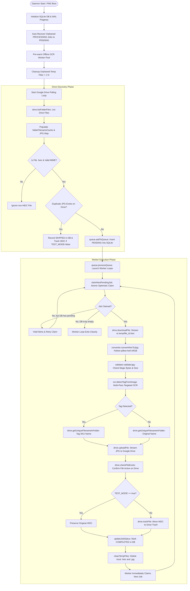
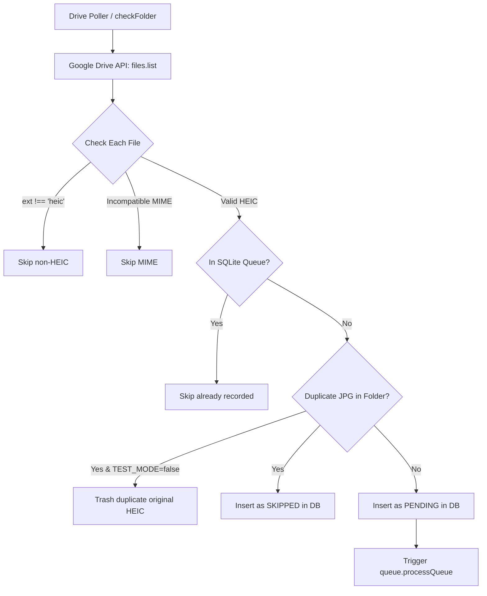
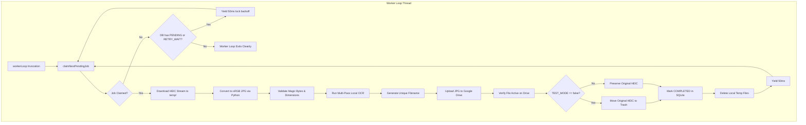
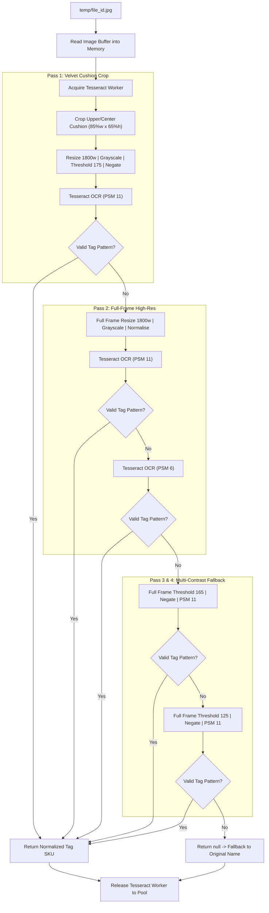
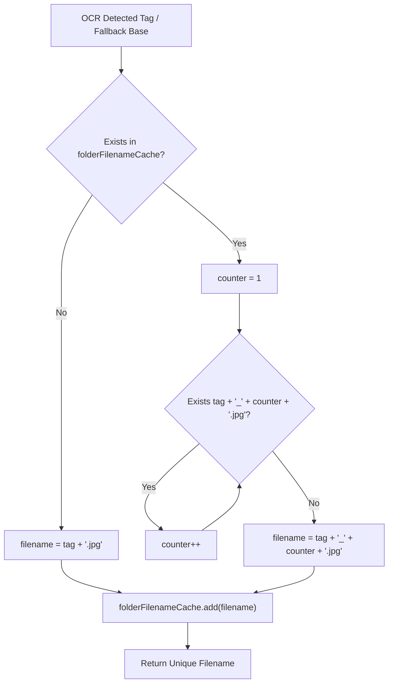
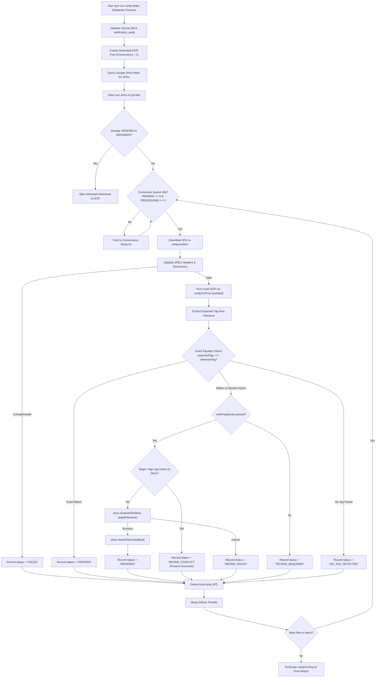

# Complete End-to-End Workflow
## HEIC Drive Converter — Step-by-Step Execution Guide & Workflow Diagrams

---

## 1. High-Level System Flow

The system operates as an event-driven and worker-driven asynchronous pipeline:



---

## 2. Step-by-Step Execution Walkthrough

### STEP 1: Service Initialization & Bootstrap
1. Node.js process starts via PM2 (`ecosystem.config.js`) or `npm start` (`src/index.js`).
2. Global exception interceptors (`process.on('uncaughtException')`, `process.on('unhandledRejection')`) are attached.
3. `db.init()` is invoked:
   - Sets SQLite PRAGMAs: `journal_mode = WAL`, `busy_timeout = 10000`, `synchronous = NORMAL`.
   - Creates table `conversion_queue` if not present.
   - Executes crash recovery: `UPDATE conversion_queue SET status = 'PENDING' WHERE status = 'PROCESSING'`, auto-recovering any jobs interrupted by a crash.
4. `ocr.prewarmWorker()` initializes `tesseract.js` worker pool asynchronously with local `eng.traineddata`.
5. `queue.cleanupOrphanedTempFiles()` scans `temp/` and unlinks any residual files older than 1 hour.
6. Initial `checkFolder()` is executed, and periodic polling is scheduled via `setInterval(checkFolder, config.pollIntervalMs)`.

### STEP 2: Google Drive Polling & Pagination
1. `src/index.js:checkFolder()` acquires single-execution lock (`if (isChecking) return`).
2. Calls `drive.listFolderFiles()` (`src/drive.js`):
   - Authenticates using Service Account (`credentials.json`) or OAuth2 refresh tokens.
   - Executes `drive.files.list()` with query: `'<FOLDER_ID>' in parents and trashed = false`.
   - Traverses pagination using `pageToken` and `pageSize: 1000` until all files in the folder are collected.
   - Automatically supports shared drives (`supportsAllDrives: true`, `includeItemsFromAllDrives: true`, `corpora: 'allDrives'`).
3. Re-populates `folderFilenameCache` (`Set` of all lowercase file names currently in the folder) for 0 ms lookups.

### STEP 3: File Filtering & Duplicate Detection
1. Builds an in-memory `Map` of existing JPG files (`lowercase filename` $\to$ `file size`).
2. Iterates over discovered Drive files:
   - **Extension Check**: Extracts extension via `getFileExtension(file.name)`. If `ext !== 'heic'`, skips immediately.
   - **MIME Check**: Calls `isHeicCompatibleMime(file.mimeType)`. Rejects non-image MIME types (`text/*`, `audio/*`, `video/*`, `application/pdf`, etc.).
   - **Database Check**: Queries `SELECT file_id FROM conversion_queue WHERE file_id = ?`. If already in database, skips.
   - **Duplicate Output Check**: Computes expected base output filename (e.g., `IMG_9422.jpg`). Checks if `existingJpgs.get('img_9422.jpg') > 0`:
     - If duplicate exists and `TEST_MODE=false`: calls `drive.trashFile(file.id)` to clean up the original HEIC.
     - Inserts record into `conversion_queue` with status `'SKIPPED'` and error `'JPG duplicate exists'`.

### STEP 4: Queue Insertion
1. For eligible candidate HEIC files, calls `queue.addToQueue(file.id, file.name, ext, file.mimeType, targetFilename)`.
2. Executes SQL:
   ```sql
   INSERT OR IGNORE INTO conversion_queue 
   (file_id, filename, ext, mime_type, target_filename, status, attempts, last_error, created_at, updated_at, next_retry_at)
   VALUES (?, ?, ?, ?, ?, 'PENDING', 0, NULL, ?, ?, 0);
   ```
3. Logs: `[INFO] Queued newly detected HEIC: IMG_9422.heic (1a2b3c4d...)`.
4. Triggers worker loop processing: `queue.processQueue()`.

### STEP 5: Worker Concurrency & Atomic Job Claiming
1. `queue.processQueue()` evaluates `activeConversions < config.maxConcurrentConversions`.
2. Spawns persistent worker loops (`workerLoop()`) up to the configured concurrency cap (e.g., 2 or 4).
3. Each worker calls `claimNextPendingJob()`:
   - Queries oldest `PENDING` job or `RETRY_WAIT` job where `next_retry_at <= Date.now()`.
   - Atomically executes optimistic locking update:
     ```sql
     UPDATE conversion_queue 
     SET status = 'PROCESSING', started_at = ?, updated_at = ?
     WHERE file_id = ? AND status = ?;
     ```
   - If `result.changes === 1`, worker successfully owns the job and proceeds to `processJob(job)`.
   - If `result.changes === 0` (collision with another worker), worker queries pending count:
     - If pending count > 0: yields 50 ms and retries claim.
     - If pending count === 0: cleanly exits loop.

### STEP 6: HEIC File Download
1. Worker creates isolated local file paths:
   - HEIC Source: `temp/${job.file_id}.heic`
   - JPG Target: `temp/${job.file_id}.jpg`
2. Invokes `drive.downloadFile(job.file_id, tempHeicPath)`:
   - Opens local write stream `fs.createWriteStream(tempHeicPath)`.
   - Calls `drive.files.get({ fileId, alt: 'media' }, { responseType: 'stream' })`.
   - Pipes HTTP media stream directly to disk.
   - Cleans up and destroys stream if an error occurs.

### STEP 7: Local HEIC Conversion & Color Normalization
1. Worker calls `converter.convertHeicToJpg(tempHeicPath, tempJpgPath)`.
2. Executes Python script `src/convert_heic.py` via `python3` / virtualenv:
   - `pillow_heif.open_heif(input_path, convert_hdr_to_8bit=True)` decodes Apple 10-bit HDR HEIC without green/red tile artifacts.
   - `ImageOps.exif_transpose(image)` handles EXIF rotation.
   - `ImageCms.profileToProfile(image, input_profile, srgb_profile, outputMode="RGB")` converts pixels from Display P3 color space to standard sRGB.
   - Embeds sRGB ICC profile metadata.
   - Flattens transparency onto a clean white `(255, 255, 255)` background.
   - Saves JPEG with `subsampling=0` (4:4:4 chroma subsampling) and `quality=95`.
3. If Python fails, cascades through `ffmpeg-native`, `sharp-direct`, and WASM fallback engines.

### STEP 8: Pre-Upload Quality & Integrity Validation
1. Worker calls `validator.validateJpg(tempJpgPath)` (`src/validator.js`):
   - **File Existence**: Confirms file exists on disk.
   - **File Size**: Confirms `stats.size >= 1024` bytes (> 1 KB).
   - **Magic Bytes**: Reads first 3 bytes and verifies `0xFF, 0xD8, 0xFF`.
   - **Dimension Check**: Parses width and height using `image-size`.
   - **Channel Sanity**: Sharp metadata inspects channel count ($\ge 3$).
2. If any check fails, throws validation error and halts upload.

### STEP 9: Multi-Pass Targeted OCR & Jewelry Tag Detection
1. Worker calls `ocr.detectTagFromImage(tempJpgPath)` (`src/ocr.js`).
2. Reads image buffer into memory once (`imageBuffer`).
3. Acquires worker from `OcrWorkerPool`.
4. **Pass 1 (Velvet Cushion Crop)**:
   - Crops upper/center cushion region (85% width, 65% height).
   - Resizes to 1200 px width, converts to grayscale, applies **binary threshold 175**, and negates (pure black text on pure white).
   - Runs Tesseract with `PSM 11` (Sparse Text).
   - Evaluates text with `extractTagPattern()`. If tag found (e.g., `DBR334`), returns immediately.
5. **Pass 2 (Full-Frame High-Res)**:
   - If Pass 1 found nothing, runs full-frame normalized image with `PSM 11`, followed by `PSM 6`.
6. **Pass 3 & 4 (High/Medium Contrast Inversion)**:
   - Evaluates full-frame threshold 165 and threshold 125.
7. Normalizes detected text:
   - Corrects `0BR334` $\to$ `DBR334`.
   - Repairs separated prefixes (`D.BR 334` $\to$ `DBR334`).
   - Fixes ghost characters (`DERS556` $\to$ `DER556`) and trailing digit substitutions (`DBR32B` $\to$ `DBR328`).
8. Releases OCR worker back to pool and frees buffer memory.

### STEP 10: Target Filename Generation & Collision Handling
1. If tag detected (e.g., `DBR334`):
   - Calls `drive.getUniqueFilenameInFolder('DBR334', '.jpg')`.
   - Checks `folderFilenameCache` for `DBR334.jpg`. If already present in folder, increments counter: `DBR334_1.jpg`, `DBR334_2.jpg`, etc.
   - Sets `uploadFilename = 'DBR334.jpg'` and `renameType = 'TAG_OCR'`.
2. If NO tag detected:
   - Uses base filename: `drive.getUniqueFilenameInFolder('IMG_9422', '.jpg')` $\to$ `IMG_9422.jpg`.
   - Sets `renameType = 'ORIGINAL_NAME'`.

### STEP 11: Google Drive Upload
1. Calls `drive.uploadFile(uploadFilename, tempJpgPath)`:
   - Creates read stream `fs.createReadStream(tempJpgPath)`.
   - Calls `drive.files.create()` with `parents: [config.driveFolderId]` and `mimeType: 'image/jpeg'`.
   - Adds uploaded filename to `folderFilenameCache`.
2. Receives uploaded file metadata (`id`, `name`, `size`).

### STEP 12: Post-Upload Verification on Google Drive
1. Calls `drive.checkFileExists(uploadedFile.id)`:
   - Calls `drive.files.get({ fileId: uploadedFile.id, fields: 'id, name, size, trashed' })`.
   - Confirms the file exists in Google Drive, has non-zero size, and is `trashed === false`.
2. If verification fails, throws error; the original HEIC file is **NEVER** touched.

### STEP 13: Safe Deletion of Original HEIC
1. Checks `config.testMode`:
   - If `TEST_MODE=true`: logs `[TEST MODE] Skipping trashing of original file: IMG_9422.heic`.
   - If `TEST_MODE=false`: calls `drive.trashFile(job.file_id)` to move original HEIC to Google Drive Trash.

### STEP 14: Job Completion & SQLite Update
1. Calls `updateJobStatus(job.file_id, 'COMPLETED', uploadFilename)`:
   ```sql
   UPDATE conversion_queue 
   SET status = 'COMPLETED', target_filename = ?, completed_at = ?, updated_at = ?
   WHERE file_id = ?;
   ```
2. Logs: `[INFO] Successfully completed & verified job for IMG_9422.heic -> DBR334.jpg [TAG_OCR]`.

### STEP 15: Temp File Cleanup
1. In `processJob()` `finally` block:
   - Calls `cleanTempFiles(tempHeicPath, tempJpgPath)`.
   - Unlinks `temp/${job.file_id}.heic` and `temp/${job.file_id}.jpg`.
2. Ensures 0 disk space leakage per completed conversion.

### STEP 16: Immediate Next Job Execution
1. Worker yields 50 ms to keep event loop balanced.
2. Loops back to `claimNextPendingJob()` to immediately claim the next pending file without waiting for the Drive polling timer.

---

## 3. Workflow Diagrams

### 3.1 Google Drive to Queue Flow



---

### 3.2 Worker Processing & Concurrency Flow



---

### 3.3 Multi-Pass Local OCR Flow



---

### 3.4 Tag to Filename Mapping & Suffix Flow



---

### 3.5 Error, Retry & Backoff Flow

```mermaid
flowchart TD
    ErrorThrown[Job Processing Throws Error] --> LogErr[logger.error: Log Message & Stack]
    LogErr --> GetAttempts[Query Current Job attempts from DB]
    GetAttempts --> IncAttempts["newAttempts = attempts + 1"]
    IncAttempts --> CheckMax{newAttempts >= MAX_ATTEMPTS (4)?}
    
    CheckMax -->|Yes| MarkFail["status = 'FAILED'<br/>next_retry_at = 0"]
    CheckMax -->|No| CalcBackoff["backoff = [60s, 120s, 300s, 900s][attempts-1]<br/>next_retry_at = Date.now() + backoff<br/>status = 'RETRY_WAIT'"]
    
    MarkFail --> UpdateDB["UPDATE conversion_queue SET status, attempts, last_error, next_retry_at"]
    CalcBackoff --> UpdateDB
    UpdateDB --> CleanTemp[cleanTempFiles: Delete local .heic/.jpg]
    CleanTemp --> NextJob[Worker immediately claims next available job]
```

---

### 3.6 Graceful Shutdown Flow

```mermaid
flowchart TD
    Signal[Receive SIGTERM / SIGINT Signal] --> LogShutdown[Log Shutdown Notice]
    LogShutdown --> StopTimer[clearInterval Polling Loop]
    StopTimer --> SetShutdownFlag["queue.shutdown(): isGracefulShutdown = true"]
    SetShutdownFlag --> PollWorkers{activeConversions > 0 AND elapsed < 10s?}
    PollWorkers -->|Yes| WaitYield[Sleep 1000ms] --> PollWorkers
    PollWorkers -->|No / Timeout| TerminateOCR[ocr.terminateWorker: Kill Tesseract Workers]
    TerminateOCR --> CloseDB[db.db.close: Release SQLite Database Locks]
    CloseDB --> ExitProcess[process.exit(0): Daemon Exits Cleanly]
```

---

### 3.7 Folder-Level Converted Image Verification & Auto-Repair Flow



